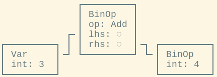
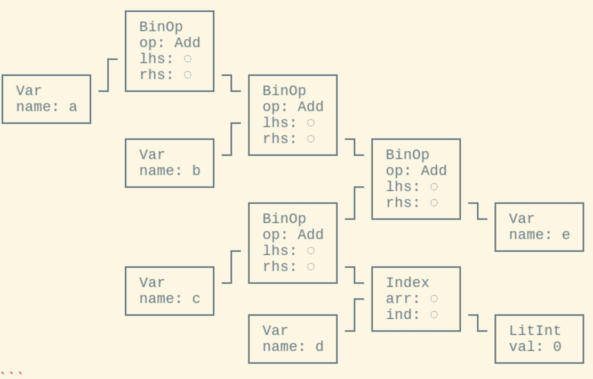
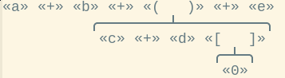
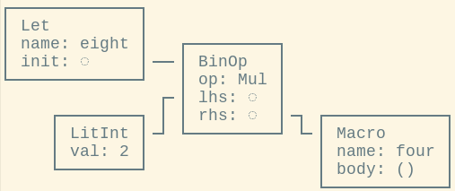
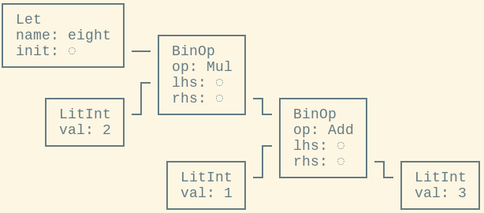

# Macros!

### CIS 198 Lecture 7

---
## What Are Macros?

- In C, a macro looks like this:

    ```c
    #define FOO 10  // untyped integral constant
    #define SUB(x, y) ((x) - (y))  // parentheses are important!
    #define BAZ a  // relies on there being an `a` in context!

    int a = FOO;
    short b = FOO;
    int c = -SUB(2, 3 + 4);
    int d = BAZ;
    ```

- Before compilation, a _preprocessor_ runs which directly substitutes tokens:

    ```c
    int a = 10;               // = 10
    short b = 10;             // = 10
    int c = -((2) - (3 + 4)); // = -(2 - 7) = 5
    int d = a;                // = 10
    ```

---
## Why C Macros Suck;

- C does a direct _token-level_ substitution.
    - e.g. `3+4` has the tokens `'3' '+' '4'`.
    - The preprocessor has no idea what variables, types, operators, numbers, or
      anything else actually _mean_.

- Say we had defined `SUB` like this:

    ```c
    #define SUB(x, y) x - y

    int c = -SUB(2, 3 + 4);
    ```

---
## Why C Macros Suck&sup1;

- C does a direct _token-level_ substitution.
    - e.g. `3+4` has the tokens `'3' '+' '4'`.
    - The preprocessor has no idea what variables, types, operators, numbers, or
      anything else actually _mean_.

- Say we had defined `SUB` like this:

    ```c
    #define SUB(x, y) x - y

    int c = -SUB(2, 3 + 4);
    ```

- This would break terribly! After substitution...

    ```c
    int c = -2 - 3 + 4;  // = -1, not 5.
    ```

&sup1; [GCC Docs: Macro Pitfalls](https://gcc.gnu.org/onlinedocs/cpp/Macro-Pitfalls.html)

---
## Why C Macros Suck

- Or if we directly used a variable name in a macro...

    ```c
    #define FOO 10
    #define BAZ a  // relies on there being an `a` in context!

    int a_smith = FOO;
    int d = BAZ;
    ```

- Now, the preprocessor produces this invalid code...

    ```c
    int a_smith = 10;  // = 10
    int d = a;         // error: `a` is undeclared
    ```
---
## Why C Macros Suck

- C macros also can't be recursive:

    ```c
    #define foo (4 + foo)

    int x = foo;
    ```

- This expands to

    ```c
    int x = 4 + foo;
    ```

    - (This particular example is silly, but recursion _is_ useful.)

---
## C Macro Processing

1. Lexing: source code to token stream
```C
#define FOO 4
3+FOO
```
    - '#define' 'FOO' '4'
    - '3' '+' 'FOO'
2. Preprocessor: macros are expanded.
    - '3' '+' 'FOO' => '3' '+' '4'
3. Tokens are processed into an AST

    

4. Rest of compilation
    - syntax checking, type checking, etc


---
## Rust Macros

- A Rust macro looks like this:

    ```rust
    macro_rules! incr {  // define the macro
        // syntax pattern => replacement code
        ( $x:ident ) => { $x += 1; };
    }

    let mut x = 0;
    incr!(x);  // invoke a syntax extension (or macro)
    ```

---
## AST

- An AST (abstract syntax tree) contains semantic information about what kind of
  operation the syntax represents.
- `a + b + ( c + d [ 0 ] ) + e` parses into the AST



---

## Token Trees

- In Rust, the lexer produces token _trees_:
    - An intermediate between token streams and ASTs.
    - Only represents brace-based nested structures ('(', '[',
      '{').
- `a + b + ( c + d [ 0 ] ) + e` parses into the token _stream_
      - `'a' '+' 'b' '+' '(' 'c' '+' 'd' '[' '0' ']' ')' '+' 'e'`
- Which then parses into the token _tree_



---
## Macro Rules

- Put simply, a macro is just a compile-time pattern match:

    ```rust
    macro_rules! mymacro {
        ($pattern1) => {$expansion1};
        ($pattern2) => {$expansion2};
        // ...
    }
    ```

- e.g. this `four!` macro is super simple:

    ```rust
    macro_rules! four {
        // For empty input, produce `1 + 3` as output.
        () => {1 + 3};
    }
    ```
    - Matches on no patterns, and always expands to `{ 1 + 3 }`.

---
## Macro Expansion

```rust
let eight = 2 * four!();
```

- This parses into the following AST:



---
## Expansions

- Translated into Rust syntax, this looks like:

```rust
let eight = 2 * (1 + 3);
```

- With _this_ AST:



---
## Entire Process

1. Lexing: Source code to token _stream_ to token _tree_
2. Parsing: Token tree to AST
    - Macros are each a single AST node which contain a token tree
3. Macro expansion:
    - Macro AST nodes replaced by their expanded AST nodes
4. Rest of compilation (type checking, borrow checking, etc)

- Thus, macros must output valid, contextually-correct Rust.
    - Enforced because AST context is already known when expansion takes place.

---
## Expansions

- Macro calls can appear in place of the following
  syntax kinds, by outputting a valid AST of that kind:
    - Patterns (e.g. in a `match` or `if let`).
    - Statements (e.g. `let x = 4;`).
    - Expressions (e.g. `x * (y + z)`).
    - Items (e.g. `fn`, `struct`, `impl`, `use`).

- They _cannot_ appear in place of:
    - Identifiers, match arms, struct fields, or types.

---
## Macro Rules

- Any valid Rust tokens can appear in the match:

    ```rust
    macro_rules! imaginary {
        (elevensies) => {"20ton"};
    }

    imaginary!(elevensies);
    imaginary!(twentington);
    ```

- In Rust, macros see _one_ token tree as input.
    - When you do `println!("{}", (5+2))`, the `"{}", (5+2)` will
      get parsed into a token tree, but _not_ fully parsed into an AST.
- The token tree can have any set of braces:

    ```rust
    macro_rules! imaginary {
        (elevensies) => {"20ton"};
    }

    imaginary![elevensies];
    ```

---
## Captures

- Portions of the input token tree can be _captured_:

    ```rust
    macro_rules! sub {
        ($e1:expr, $e2:expr) => { ... };
    }
    ```

- Captures are always written as `$name:kind`.
    - Possible kinds are:
        - `item`: an item, like a function, struct, module, etc.
        - `block`: a block (i.e. `{ some; stuff; here }`)
        - `stmt`: a statement
        - `pat`: a pattern
        - `expr`: an expression
        - `ty`: a type
        - `ident`: an identifier
        - `path`: a path (e.g. `foo`, `::std::mem::replace`, ...)
        - `meta`: a meta item; the things that go inside `#[...]`
        - `tt`: a single token tree

---
## Captures

- Captures can be substituted back into the expanded tree

    ```rust
    macro_rules! sub {
        ( $e1:expr , $e2:expr ) => { $e1 - $e2 };
    }
    ```

- A capture will always be inserted as a **single** AST node.
    - For example, `expr` will always mean a valid Rust expression.
    - This means we're no longer vulnerable to C's substitution
      problem (the invalid order of operations).
    - Multiple expansions will still cause multiple evaluations:

    ```rust
    macro_rules! twice {
        ( $e:expr ) => { { $e; $e } }
    }

    fn foo() { println!("foo"); }

    twice!(foo());  // expands to { foo(); foo() }: prints twice
    ```

---
## Repetitions

- If we want to match a list, a variable number of arguments, etc.,
  we can't do this with the rules we've seen so far.
- _Repetitions_ allow us to define repeating subpatterns.
- These have the form `$ ( ... ) sep rep`.
    - `$` is a literal dollar token.
    - `( ... )` is the paren-grouped pattern being repeated.
    - `sep` is an *optional* separator token.
        - Usually, this will be `,` or `;`.
    - `rep` is the *required* repeat control. This can be either:
        - `*` zero or more repeats.
        - `+` one or more repeats.
- The same pattern is used in the output arm.
    - The separator doesn't have to be the same.

---
## Repetitions

- Takes a space-delimited list and prints each element.

```rust
macro_rules! repeat {
  ( $( $elem:expr )-* ) => {
    $( println!("{}", $elem) );*
  }
}

repeat!(1 2 3);
```

???

Notice you can insert a separator in the repetition- expansion (although in this
case it can go inside the expanded-expressoin as well)

---
## Exercise! vec

- Implement `vec!`
    - Takes zero-or-more elements and inserts them into a vector.

```rust
macro_rules! vec! {
    // ...
}
```

---
## Exercise! vec

```rust
macro_rules! vec {
    ( $( $elem:expr ),* ) => {
        { // Braces so we output only one AST (block kind)
            let mut v = Vec::new();

            $(                 // Same syntax to expand a repetition
                v.push($elem); // Expands once for each input rep
             ) *               // No sep; zero or more reps

            v                  // Return v from the block.
        }
    }
}
println!("{:?}", vec![3, 4]);
```

---
## Exercise! vec

- Condensed:

```rust
macro_rules! myvec {
    ( $( $elem:expr ),* ) => {
        {
            let mut v = Vec::new();
            $( v.push($elem); )*
            v
        }
    }
}
println!("{:?}", myvec![3, 4]);
```

---
## Exercise! csv

- Take a list of variable names (identifiers) and print them in CSV format.
    - One line, each element separated by commas.

```rust
macro_rules! csv {
    // ...
}
```

---
## Exercise! csv

- Take a list of variable names (identifiers) and print them in CSV format.
    - One line, each element separated by commas.

```rust
macro_rules! csv {
    // ...
}
```

- There's no way to count the number of captures in a repetition...

---
## Counting

- But you can use a repetition twice in a macro expansion:
    - Once to generate the format string
    - Once to insert arguments
- Or you can iteratively call `print!`, then print a newline at the end.

---

## Counting

- You can try to count repetition matches by generating an arithmetic
  expression:

```rust
macro_rules! replace_expr {
    ($_t:tt $sub:expr) => {$sub};
}

macro_rules! count_tts {
    ($($tts:tt)*) => {0 $(+ replace_expr!($tts 1))*};
}
```

- You need `replace_expr!` because you can't expand a repetition match without
  invoking the repeating variable.
- This works, but only up to values of 500 or so...
- This expands to the token stream `0 + 1 + ... + 1`, which must be parsed into
  an AST.

---
## Counting

```rust
macro_rules! count_tts {
    () => {0usize};
    ($_head:tt $($tail:tt)*) => {1usize + count_tts!($($tail)*)};
}
```

- Rust allows macro recursion (or nested macros)
- The compiler will keep expanding macros until there are none left in the AST
  (or the recursion limit is hit).
- The compiler's recursion limit can be changed with
  `#![recursion_limit="64"]`.
    - 64 is the default.
    - This applies to all recursive compiler operations, including
      auto-dereferencing and macro expansion.
---
## Counting

- The _fastest_ way is to count by creating an array literal, and evaluating
  `len` on it.
- Because of the way this is parsed, it doesn't create an _unbalanced_ AST like
  the arithmetic expression does.
- Tested to work with about 10k tokens.

---
## Matching

- Macro rules are matched in order.
- The parser can never backtrack. Say we have:

    ```rust
    macro_rules! dead_rule {
        ($e:expr) => { ... };
        ($i:ident +) => { ... };
    }
    ```

- If we call it as `dead_rule(x +);`, it will actually fail.
    - `x +` isn't a valid expression, so we might think it
      would fail on the first match and then try again on the second.
    - This doesn't happen!
    - Instead, since it _starts_ out looking like an expression,
      it commits to that match case.
        - When it turns out not to work, it can't _backtrack_
          on what it's parsed already, to try again.
          Instead it just fails.

---
## Matching

- To solve this, we need to put more specific rules first:

    ```rust
    macro_rules! dead_rule {
        ($i:ident +) => { ... };
        ($e:expr) => { ... };
    }
    ```

- Now, when we call `dead_rule!(x +);`, the first case will match.
- If we called `dead_rule!(x + 2);`, we can now fall through to the
  second case.
    - Why does this work?
    - Because if we've seen `$i:ident +`, the parser already knows
      that this looks like the beginning of an expression, so it can
      fall through to the second case.

---
## Macro Hygiene

- In C, we talked about how a macro can implicitly use (or conflict)
  with an identifier name in the calling context (`#define BAZ a`).

- Rust macros are _partially hygenic_.
    - Hygenic with regard to most identifiers.
        - These identifiers get a special context internal to
          the macro expansion.
    - NOT hygenic: generic types (`<T>`), lifetime parameters (`<'a>`).

    ```rust
    macro_rules! using_a {
        ($e:expr) => {     { let a = 42;  $e }  }
    } // Note extra braces ^                 ^

    let four = using_a!(a / 10); // this won't compile - nice!
    ```

    - We can imagine that this expands to something like:

    ```rust
    let four = { let using_a_1232424_a = 42; a / 10 };
    ```

---
## Macro Hygiene

- But if we _want_ to bind a new variable, it's possible.
    - If a token comes in as an input to the function, then it is
      part of the caller's context, not the macro's context.

    ```rust
    macro_rules! using_a {
        ($a:ident, $e:expr) => {  { let $a = 42;  $e }  }
    }        // Note extra braces ^                  ^

    let four = using_a!(a, a / 10); // compiles!
    ```

    - This expands to:

    ```rust
    let four = { let a = 42; a / 10 };
    ```

---
## Macro Hygiene

- It's also possible to create identifiers that will be visible
  outside of the macro call.
    - This won't work due to hygiene:

    ```rust
    macro_rules! let_four {
        () => { let four = 4; }
    }       // ^ No extra braces

    let_four!();
    println!("{}", four); // `four` not declared
    ```
    - But this will:

    ```rust
    macro_rules! let_four {
        ($i:ident) => { let $i = 4; }
    }               // ^ No extra braces

    let_four!(myfour);
    println!("{}", myfour); // works!
    ```

---
## Macro Debugging

- Rust has an unstable feature for debugging macro expansion.
    - Especially recursive macro expansions.

    ```rust
    #![feature(trace_macros)]
    macro_rules! each_tt {
        () => {};
        ( $_tt:tt $($rest:tt)* ) => { each_tt!( $($rest)* ); };
    }

    trace_macros!(true);
    each_tt!(spim wak plee whum);
    trace_macros!(false);
    ```

    - This will cause the compiler to print:

    ```
    each_tt! { spim wak plee whum }
    each_tt! { wak plee whum }
    each_tt! { plee whum }
    each_tt! { whum }
    each_tt! {  }
    ```

- More tips on macro debugging in [TLBORM 2.3.4](https://danielkeep.github.io/tlborm/book/mbe-min-debugging.html)

---
## Macro Scoping

- Macro scoping is unlike everything else in Rust.
    - Macros are immediately visible in submodules:

    ```rust
    macro_rules! X { () => {}; }

    mod a {  // Or `mod a` could be in `a.rs`.
        X!(); // valid
    }
    ```

    - Macros are only defined _after_ they appear in a module:

    ```rust
    mod a { /* X! undefined here */ }

    mod b {
        /* X! undefined here */
        macro_rules! X { () => {}; }
        X!(); // valid
    }

    mod c { /* X! undefined */ } // They don't leak between mods.
    ```

---
## Macro Scoping

- Macros can be exported from modules:

    ```rust
    #[macro_use]  // outside of the module definition
    mod b {
        macro_rules! X { () => {}; }
    }

    mod c {
        X!(); // valid
    }
    ```

    - Or from crates, using `#[macro_export]` in the crate.

---
## Macro Callbacks

- Because of the way macros are expanded, "obviously correct"
  macro invocations like this won't actually work:

    ```rust
    macro_rules! expand_to_larch {
        () => { larch };
    }

    macro_rules! recognise_tree {
        (larch) => { println!("larch") };
        (redwood) => { println!("redwood") };
        ($($other:tt)*) => { println!("dunno??") };
    }

    recognise_tree!(expand_to_larch!());
    ```

    - This will be expanded like so:

    ```rust
    -> recognize_tree!{ expand_to_larch ! ( ) };
    -> println!("dunno??");
    ```

    - Which will match the third pattern, not the first.

---
## Macro Callbacks

- This can make it hard to split a macro into several parts.
    - This isn't always a problem - `expand_to_larch ! ( )` won't match
      an `ident`, but it _will_ match an `expr`.

- The problem can be worked around by using a _callback_ pattern:

    ```rust
    macro_rules! call_with_larch {
        ($callback:ident) => { $callback!(larch) };
    }

    call_with_larch!(recognize_tree);
    ```

    - This expands like this:

    ```rust
    -> call_with_larch! { recognise_tree }
    -> recognise_tree! { larch }
    -> println!("larch");
    ```

---
## Macro TT Munchers

- This is one of the most powerful and useful macro design patterns.
  It allows for parsing fairly complex grammars.

- A _tt muncher_ is a macro which matches a bit at the beginning of
  its input, then recurses on the remainder of the input.
    - `( $some_stuff:expr $( $tail:tt )* ) =>`
    - Usually needed for any kind of actual language grammar.
    - Can only match against literals and grammar constructs
      which can be captured by `macro_rules!`.
    - Cannot match unbalanced groups.

---
## Macro TT Munchers

```rust
macro_rules! mixed_rules {
    () => {}; // Base case
    (trace $name:ident ; $( $tail:tt )*) => {
        {
            println!(concat!(stringify!($name), " = {:?}"), $name);
            mixed_rules!($($tail)*);  // Recurse on the tail of the input
        }
    };
    (trace $name:ident = $init:expr ; $( $tail:tt )*) => {
        {
            let $name = $init;
            println!(concat!(stringify!($name), " = {:?}"), $name);
            mixed_rules!($($tail)*);  // Recurse on the tail of the input
        }
    };
}
```

---
## Macros Rule! Mostly!

- Macros are pretty great - but not perfect.
    - Macro hygiene isn't perfect.
    - The scope of where you can use a macro is weird.
    - Handling crates inside of exported macros is weird.
    - It's impossible to construct entirely new identifiers
      (e.g. by concatenating two other identifiers).
    - ...
- A new, incompatible macro system may appear in future Rust.
    - This would be a new syntax for writing syntax extensions.

---
## Rust Macros from the Bottom Up

- Almost all material stolen from Daniel Keep's _excellent_ book:
    - [The Little Book of Rust Macros][tlborm] (TLBORM).
    - This section from [Chapter 2][tlborm-2].

[tlborm]: https://danielkeep.github.io/tlborm/book/
[tlborm-2]: https://danielkeep.github.io/tlborm/book/mbe-README.html

---
## Macros 1.1

- Procedural macros!
- In work for a long time.
- Pushed by demand from major crates like [Serde].

[serde]: https://github.com/serde-rs/serde

---
## Procedural Macros

- Procedural macros let you _execute code_ during compilation.
    - Write functions that take token streams and output token streams.
    - Of the type `proc_macro::TokenStream`
- Regular macros use pattern matching only.
- This already existed in the form of (nightly-only) syntax extensions.
- Macros 1.0 has an updated interface
    - tokens tream sonly, no interaction with the AST

---
## Custom Derive

- Allow you to write `derive` traits.
- For a trait `Foo`:
    - Write a function `fn(TokenStream) -> TokenStream` with an attribute
      #[proc_macro_derive(Foo)]
- Already implemented in Serde!
