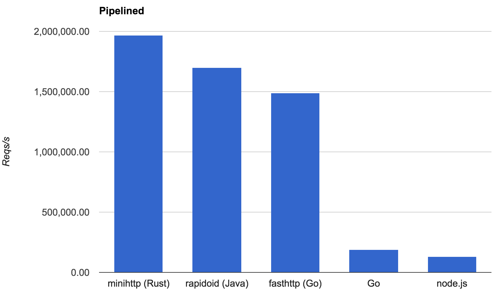

# Concurrency II

### CIS 198 Lecture 11

---
## Review: Threads

- `thread::spawn` takes a closure defining the thread's behavior.
- Returns a handler that can be used to wait on the thread.

```rust
use std::thread;

// Spawn a new thread.
let handler = thread::spawn(|| println!("Hello world!") );

// Wait until the thread has terminated.
handler.join();
```

---
## Review: Arc

- An Atomic Reference Counted pointer
    - Internally tracks how many pointers have been aliased
- The `Arc` owns an immutable refernece to its data
- It goes out of scope when the reference count reaches zero

```rust
use std::sync::Arc;

// Create a new Arc pointer
let mut arc = Arc::new(5);

// Clone the arc to get a new pointer
let local_ptr = arc.clone();

// Use it as a normal reference
thread::spawn( || {
    println!("{}", local_ptr);
});
```

---
### Exercise: Arc

- Given a vector, spawn a thread that prints out each element in the vector

```rust
fn print_vector(vector: Vec<i32>) {
    // TODO
}
```

- Be sure to `join` each thread at the end so the main doesn't terminate early.

---
### Exercise: Arc

- Now change your function to take in a generic `T`.
- `T` will have to be `Send` and `Sync`. What else?
    - Follow the compiler suggestions!

---
## Review: Mutex

- An Mutual Exclusion pointer
- Many pointers to the mutex can be aliased
- Only one can enter the critical section at a time, by acquiring a lock

```rust
let arc = Arc::new(Mutex::new(vector));

// Clone the Arc to get a local pointer to the Mutex
let local_mutex = arc.clone();

// Lock the mutex (for mutual exclusion) and unwrap the Result
let local_ptr = local_mutex.lock().unwrap();
```

---
### Exercise: Square

- Given a vector, spawn a thread to square each element in the vector

```rust
fn square_vector(vector: Vec<i32>) {
    // TODO
}
```

---
## Rayon: Parallel Iterators

- Parallel iterators are really easy!
    - (As long as everything is `Send` and `Sync`)
- Rayon provides drop-in replacements:
    - Use `par_iter()` or `par_iter_mut()`.
- Rayon also provides a number of parallel iterator adapters (`map`, `fold`, `filter`, etc.).

```rust
use rayon::prelude::*;
fn sum_of_squares(input: &[i32]) -> i32 {
    input.par_iter()
         .map(|&i| i * i)
         .sum()
}
```

- Sources (content and code examples):
    - [Rayon on GitHub](https://github.com/nikomatsakis/rayon)
    - [Rayon blog post](http://smallcultfollowing.com/babysteps/blog/2015/12/18/rayon-data-parallelism-in-rust/)

---
### Exercise: Square

- Create a new Cargo project and add Rayon to Cargo.toml:

```toml
[dependencies]
rayon = "0.4.3"
```

- And add to the top of your main file:

```rust
extern crate rayon;
use rayon::prelude::*;
```

- Use Rayon's parallel iterators to square each element in the vector.
- Use `for_each` instead of `map` if you aren't building a new value.

```rust
fn square_vector(mut vector: Vec<i32>) {
    // TODO
}
```

---
### Exercise: Dot product

- Use Rayon to calculate the dot product of two vectors.

```rust
fn dot(v1: Vec<i32>, v2: Vec<i32>) -> i32 {
    // TODO
}
```

---
### Recursive Divide-And-Conquer

- Rayon provides a primitive, `join`, which takes two closures
- And _potentially_ runs them in parallel.
    - Dynamically decides (based on available resources) if they should be
      parallelized.
- Parallel iterators are built on this method, and `par_iter()` abtracts over it.

```rust
use rayon::prelude::*;
fn increment_all(input: &mut [i32]) {
    input.par_iter_mut()
         .for_each(|p| *p += 1);
}
```

---
### Recursive Divide-And-Conquer

- We can rewrite `increment_all()` using `join()`.
- Even though this actually complicates the implementation.

```rust
// Increment all values in slice.
fn increment_all(slice: &mut [i32]) {
    if slice.len() < 1000 {
        for p in slice { *p += 1; }
    } else {
        let mid_point = slice.len() / 2;
        let (left, right) = slice.split_at_mut(mid_point);
        rayon::join(|| increment_all(left),
                    || increment_all(right));
    }
}
```

- [Rayon on GitHub](https://github.com/nikomatsakis/rayon)

---
### Recursive Divide-And-Conquer

- Be careful: `join` is not the same as just spawning two threads (one per
    closure).
- If all CPUs are already busy, Rayon will opt to run the closures in sequence.
- `join` is designed to have low overhead, but may have performance
    implications on small workloads.
    - You may want to have a serial fallback for smaller workloads.
    - Parallel iterators already have this in place, but `join` is lower-level.

---
### Safety

- Basic examples that would intuitively violate borrowing rules are invalid in
    Rayon:

```rust
// This fails to compile, since both threads in `join`
// try to borrow `slice` mutably.
fn increment_all(slice: &mut [i32]) {
    rayon::join(|| process(slice), || process(slice));
}
```

---
### Safety

- Rayon is guaranteed to be free of data races.
- Rayon _itself_ cannot cause deadlocks.
- As a consequence, you can't use any types with Rayon which are not thread-safe.

---
### Internals

- Rayon is built on the concept of _work stealing_.
    - A combination of a threadpool and work queue(s).
- When you call `join(a, b)`, `a` is started, and `b` gets added to the queue.
- Once `a` completes, the thread that ran `a` checks to see if `b` was taken off
    the queue, and runs it if not.
- If a thread is currently idle, it might _steal_ a job off another thread's
  queue.

---
## Scoped Threads

- Threads which are guaranteed to terminate before the current stack frame goes
    away.
- The thread is "scoped" to the stack frame in which it was created.
- Such threads can access their parent stack frame directly.
    - This data is guaranteed to always be valid from the thread's view.
- Simple, right? 😼

---
## Scoped Threads

- Rust does not have a standard scoped thread library (anymore).
- Instead, there are three notable ones:
    - [scoped_threadpool](https://github.com/Kimundi/scoped-threadpool-rs)
    - [scoped_pool](https://github.com/reem/rust-scoped-pool)
    - [crossbeam](https://github.com/aturon/crossbeam)
- These are all relatively* similar, so we'll look at some high-level features
    from each.

---
## Thread Pools

- A few libraries provide _thread pools_.
- Thread pools are a collection of threads that can be scheduled to a set of tasks.
- Threads are created up-front and stored in memory in the pool, and can be
    dispatched as needed.

---
## Thread Pools

- Threads are not destroyed when they complete, but are saved for re-use.
- _Ad hoc_ thread creation & destruction can be very expensive.
- Choosing a good thread pool size is often an indeterminate problem.
    - Pool size is best chosen based on system requirements.

---
## Thread Pools

- One nice feature of Rust is that thread lifetimes can be expressed explicitly.
- It's very easy to statically reason about how long threads will live.
    - Can also enforce guarantees about what thread scopes are tied to what
      lifetimes.

---
### Interlude: Thread Unsoundness Bug

- Remember how we said scoped threads used to be in `std`?
- Before Rust 1.0, a serious bug was discovered with scoped threads and a few
    other types.
- In short, it was possible to create a scoped thread, leak it with `mem::forget`,
    and have it end up accessing freed memory.
- See discussion [here](https://github.com/rust-lang/rust/issues/24292) and
    [here](https://doc.rust-lang.org/nomicon/leaking.html).

---
## Futures & Streams

- Interface for asynchronous computation
- The computation behind a `Future` or `Stream` may be run in another thread, or
  may be kicked off as a callback to some other operation.

- [Zero Cost Futures in Rust](https://aturon.github.io/blog/2016/08/11/futures/) - Aaron Turon

---
### Futures & Streams

- A `Future` is like a `Result` whose value is computed asynchronously.
- Futures can be polled for their information, blocked on, ANDed together with
  other Futures, etc.
- `Stream`s are similar to `Future`s, but represent a sequence of values instead
  of just one.

---
### Futures & Streams

- Futures are useful for offloading slow computational tasks into the "background".
- Easier than running a raw thread with the desired computation.
- Example: Requesting large images from an HTTP server might be slow, so it
    might be better to fetch images in parallel asynchronously.

---
### Example

```rust
// Given an `input` I/O object create a stream of requests
let requests = ParseStream::new(input);

// For each request, run our service's `process` function
// to handle the request and generate a response
let responses = requests.and_then(|req| service.process(req));

// Create a new future that'll write out each response to
// an `output` I/O object
StreamWriter::new(responses, output)
```

- [Zero Cost Futures in Rust](https://aturon.github.io/blog/2016/08/11/futures/) - Aaron Turon

---
### What's Zero Cost?

- Future combinations don't require any allocation.
- A single dynamic dispatch is required per event.
- No synchronization overhead.

- Provides similar performance to writing the state machine directly using mio.

- [Zero Cost Futures in Rust](https://aturon.github.io/blog/2016/08/11/futures/) - Aaron Turon

---
### Performance

[](https://aturon.github.io/blog/public/bench-pipelined.png)

---
### mio

- Very lightweight asynchronous IO libary
- Nonblocking sockets
- High performance timers
- Threadsafe message channels
