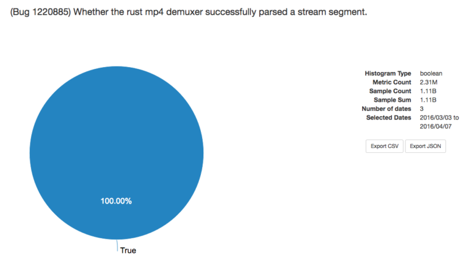

# Rust News

### CIS 198 Lecture 14

---
# Final project stuff

- Tuesday 12/13
- 12pm
- Towne hallways
- Final project extra credit for participating!
    - (3pts on hw)

---
## Procedural Macros

- (aka syntax extensions, compiler plugins)
- The current macro system is confusing and messy.
- http://www.ncameron.org/blog/macros-and-syntax-extensions-and-compiler-plugins-where-are-we-at/

---
## Custom Derive

```rust
#[proc_macro_derive(B)]
pub fn derive(input: TokenStream) -> TokenStream {  
    let input = input.to_string();
    format!("{}\n impl B for A {{ fn b(&self) {{}} }}", input).parse().unwrap()
}

#[derive(B)]
struct A;
```

---
## Procedural Macros

- More work to be done with stabilizing the semantics of procedural macros
- They will be _token to token_ macros (do not involve the AST)
- Also planning work on declarative macros
- This will be a slow and major change touching several different types of macro
  systems.

---
## Impl Trait

- https://github.com/rust-lang/rfcs/blob/master/text/1522-conservative-impl-trait.md

---
## ? Operator

- Replaces `try!`
- `try!(try!(bind_socket()).send_data())` becomes `bind_socket()?.send_data()`

---
## Incremental Compilation

- Initially announced at the beginning of this semester (9/8/16)
- https://blog.rust-lang.org/2016/09/08/incremental.html

---
## Rust in Firefox

- Media formats are arcane and complicated
- Media file parsers are a huge vector for memory corruption bugs
- Memory safety and speed make Rust an ideal candidate for writing parsers
- Shipped with Firefox 48!
- https://hacks.mozilla.org/2016/07/shipping-rust-in-firefox/

---
## Rust in Firefox

- Rust was able to match the speed of existing C code
- Had some consumer machine production problems
    - Old machines that couldn't spawn threads.
    - Old machines that didn't support float operations.



---
## Rust Language Server

- Work on improving IDE support (a major focus point on the Rust roadmap)
- A self-contained application for IDE support
    - Uses the Language Server Protocol (supported by Eclipse, Visual Studio Code)
- Runs a server in the background which processes your code
    - Reports errors as you type, goto definitions, renaming/refactoring
- https://internals.rust-lang.org/t/introducing-rust-language-server-source-release/4209

---
## Rust Mercurial Server

- This means you could use Mercurial to back your monorepo while still providing the illusion of multiple "sub-repos" to Mercurial or Git clients. The author is also interested in things like GraphQL to query repo data. Facebook engineers are crazy... in a good way.
- https://groups.google.com/forum/#!topic/mozilla.dev.version-control/nh4fITFlEMk
